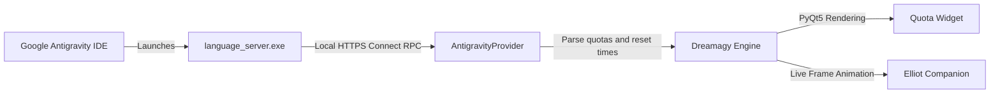

<div align="center">

# DREAMAGY

**Minimalist Floating Quota Widget and Desktop Companion for Google Antigravity**

`Python 3.10+` • `PyQt5` • `Windows` • `MIT License`

[Русский](README.md) • [English](README.en.md) • [中文](README.zh.md)

<br />


<br />
<br />

**Dreamagy** is a lightweight floating desktop widget that tracks real-time model quotas and rate limits for **Google Antigravity** (Gemini 3.8 Flash, Gemini 3.1 Pro, Claude Sonnet/Opus, GPT-OSS). Inspired by [Quotty](https://github.com/confeden/Quotty) and **Mr. Robot**.

</div>

---

## Visual Effects and Animations

<div align="center">
<table>
  <tr>
    <td align="center" width="55%">
      <b>Quota Bar</b><br /><br />
      <br />
      <sub>Light sweep shimmer, floating particles, and status colors</sub>
    </td>
    <td align="center" width="45%">
      <b>Companion: Elliot Alderson</b><br /><br />
      <br />
      <sub>Live video sequence, breathing, click reactions, and typing focus</sub>
    </td>
  </tr>
</table>
</div>

### Quota Bar
- **Shimmer Light Sweep**: A soft light wave glides across the progress bar track.
- **Floating Particles**: Luminous micro-bubbles gently drift inside the filled portion of the capsule.
- **Color Indicators**:
  - `> 40%` - Green (`#34d399`): Healthy quota reserve.
  - `15% - 40%` - Amber (`#f59e0b`): Moderate consumption warning.
  - `< 15%` - Red (`#ef4444`): Critical quota level.
- **Reset Timers**: Clean countdowns for weekly renewal (Mondays) and rolling 5-hour windows.

### Interactive Companion: Elliot Alderson
- **Live Video Animation**: Real Elliot sequence from Mr. Robot with fluid motion, head turns, and natural breathing.
- **Typing Focus**: Global keystroke detection (`GetAsyncKeyState`) shifts Elliot into a concentrated hacking posture while you write code.
- **Click Interactions**: Clicking the character triggers responsive posture changes or classic fsociety quotes like `"hello, friend."`.
- **Docked and Detached Modes**: Keep Elliot docked to the quota pill or detach him into an independent floating window (scale 0.75x, 1.0x, 1.25x, 1.5x).
- **Custom Companions**: Load any custom avatar or image directly through the right-click menu.

---

## Key Features

- **Zero Config & No API Keys**: Automatically discovers the local Antigravity Language Server, grabs the CSRF token, and reads quotas via local HTTPS.
- **100% Offline & Private**: All communication happens strictly over `127.0.0.1`. No telemetry, no remote servers.
- **Floating Glassmorphism UI**: Dark semi-transparent pill that stays on top, supports free drag-and-drop, and saves coordinates automatically.
- **Settings Dialog**:
  - **Appearance**: Custom background and quota threshold colors.
  - **Typography**: Select system fonts (`Segoe UI`, `JetBrains Mono`, etc.) and font size.
  - **Animations**: Independent toggles for particles, shimmer, and companion motion to save resources if needed.
  - **Language**: Instant 1-click switching between Russian, English, and Chinese.
- **Configurable Quota Rows**: Switch between 2 rows, 3 rows, or custom pools (Gemini Weekly, Gemini 5h, Claude & GPT).
- **System Tray Integration**: Tray menu, minimize/hide, opacity slider (50%-100%), and 1-click center reset.

---

## Installation and Quick Start

### Requirements
- Windows 10 or 11
- Python 3.10 or newer
- Running Google Antigravity instance

### Quick Start

1. Clone the repository:
   ```bash
   git clone https://github.com/shawermun/dreamagy.git
   cd dreamagy
   ```

2. Install dependencies:
   ```bash
   pip install -r requirements.txt
   ```

3. Launch the widget:
   ```bash
   python main.py
   ```
   *Or simply double-click `run.bat`.*

### Windows Startup Setup (Optional)
1. Press `Win + R`, type `shell:startup`, and hit Enter.
2. Create a shortcut to `run.bat` and drop it into the startup folder.

---

## Controls

| Action | Result |
| :--- | :--- |
| **LMB + Drag** | Freely move the widget anywhere on screen |
| **RMB on Widget** | Open context menu and settings |
| **Click on Elliot** | Trigger character reaction or quote |
| **Type on Keyboard** | Activates companion concentration mode |
| **Tray Icon** | Quick menu, force refresh quotas, and exit |

---

## Architecture



1. `antigravity_provider.py` locates the PID of `language_server.exe`.
2. Extracts the one-time CSRF token (`--csrf_token`) and active HTTPS port from process arguments.
3. Queries local Connect RPC endpoints:
   - `/GetUserStatus` - tier and account info.
   - `/RetrieveUserQuotaSummary` - exact buckets for `gemini-weekly`, `gemini-5h`, `3p-weekly`, `3p-5h`.
4. Rendered via PyQt5 with a frameless translucent window.

---

## Project Structure

```
dreamagy/
├── assets/
│   ├── demo.gif              # Main preview animation
│   ├── quota_bars.gif        # Quota bar animation demo
│   ├── elliot.gif            # Elliot companion animation demo
│   ├── elliot.png            # Static Elliot photo asset
│   └── pets/                 # Custom skins and animation frames
├── antigravity_provider.py   # Local Antigravity RPC connector
├── config.py                 # Configuration loader and saver
├── config.json               # User preferences file
├── i18n.py                   # Localization module (RU, EN, ZH)
├── main.py                   # Application entry point
├── pet_elliot.py             # Companion engine and animations
├── settings_dialog.py        # Settings dialog
├── tray.py                   # Windows system tray integration
├── widget.py                 # Main widget with particles and shimmer
├── requirements.txt          # Python dependencies
├── run.bat                   # Quick launcher script
├── README.md                 # Russian documentation
├── README.en.md              # English documentation
└── README.zh.md              # Chinese documentation
```

---

## License

Distributed under the MIT License. See `LICENSE` for details.

<div align="center">
<sub>Inspired by Quotty and Mr. Robot. Built for developers using Google Antigravity.</sub>
</div>
