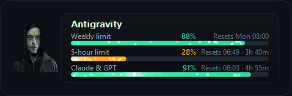
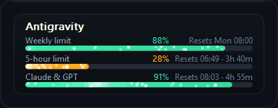
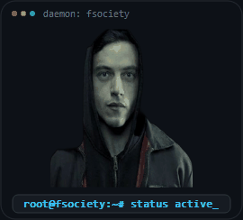
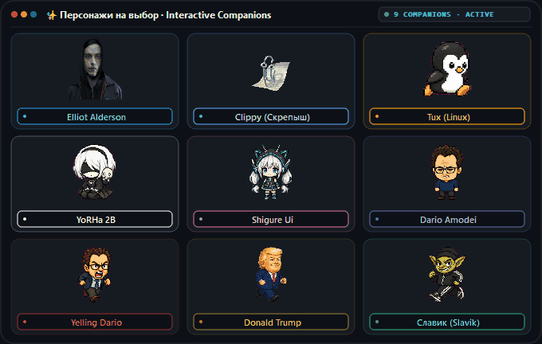

<div align="center">

# DREAMAGY

**Минималистичный парящий виджет и интерактивный компаньон для Google Antigravity**

`Python 3.10+` • `PyQt5` • `Windows 10/11` • `MIT License`

[Русский](README.md) • [English](docs/README.en.md) • [中文](docs/README.zh.md)

<br />



<br />
<br />

**Dreamagy** — компактный десктопный виджет, отображающий точный остаток квот и время сброса лимитов моделей в **Google Antigravity** (Gemini 3.8 Flash, 3.1 Pro, Claude Sonnet/Opus).

</div>

---

## ⚡ Визуальные эффекты

<div align="center">
<table>
  <tr>
    <td align="center" width="52%">
      <b>Полосы квот (Quota Bars)</b><br /><br />
      <br />
      <sub>Световой блик (shimmer), плавающие частицы и цветовой статус</sub>
    </td>
    <td align="center" width="48%">
      <b>Компаньон: Эллиот (Mr. Robot)</b><br /><br />
      <br />
      <sub>Живая видео-секвенция, дыхание и реакция на набор текста</sub>
    </td>
  </tr>
</table>
</div>

---

## 🐾 Интерактивные компаньоны

<div align="center">
  
</div>

В виджет встроена витрина персонажей, которые оживляют рабочее пространство:
* **9 анимированных героев**: Эллиот Алдерсон (*Mr. Robot*), Скрепыш (Clippy), Tux (Linux), YoRHa 2B (*NieR:Automata*), Shigure Ui, Дарио Амодеи, Дональд Трамп и Славик.
* **Реакция на набор текста**: когда вы печатаете код, питомцы начинают бежать или проверять код, а Эллиот наклоняется к терминалу.
* **Интерактивные реплики**: клик по персонажу вызывает фирменную цитату в неоновом облачке.
* **Два режима**: можно закрепить питомца на плашке виджета или отстегнуть в свободное парящее окно с масштабированием (от 0.75x до 1.5x).

---

## 🛠️ Возможности

* **Без API-ключей и настройки**: программа сама находит локальный языковой сервер Antigravity и считывает квоты напрямую через `127.0.0.1`.
* **100% Приватность**: нет отправки данных во внешнюю сеть или сторонних серверов.
* **Obsidian Glassmorphism**: полупрозрачная плашка поверх окон, которую можно перетащить в любое место экрана.
* **Гибкая кастомизация**: настройка прозрачности, системных шрифтов (`Segoe UI`, `JetBrains Mono`), выбор рядов квот (Gemini Weekly, 5h, Claude & GPT) и меню в системном трее.

---

## 🚀 Установка и запуск

```bash
# 1. Клонируем репозиторий
git clone https://github.com/shawermun/dreamagy.git
cd dreamagy

# 2. Устанавливаем зависимости
pip install -r requirements.txt

# 3. Запускаем
python main.py
```

> **Совет**: на Windows можно просто запустить файл **`run.bat`**. Чтобы виджет открывался вместе с системой, скопируйте ярлык `run.bat` в папку автозагрузки (`Win + R` → `shell:startup`).

---

<div align="center">
<sub>Лицензия MIT • Сделано для пользователей Google Antigravity</sub>
</div>
