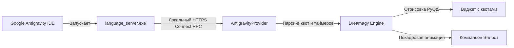

<div align="center">

# DREAMAGY

**Минималистичный парящий виджет и интерактивный компаньон для Google Antigravity**

`Python 3.10+` • `PyQt5` • `Windows` • `MIT License`

[Русский](README.md) • [English](README.en.md) • [中文](README.zh.md)

<br />


<br />
<br />

**Dreamagy** - компактный виджет для рабочего стола, который показывает реальные квоты и лимиты моделей в **Google Antigravity** (Gemini 3.8 Flash, Gemini 3.1 Pro, Claude Sonnet/Opus, GPT-OSS). Проект вдохновлен минимализмом [Quotty](https://github.com/confeden/Quotty) и сериалом **Mr. Robot**.

</div>

---

## Визуальные эффекты и анимация

<div align="center">
<table>
  <tr>
    <td align="center" width="55%">
      <b>Полоса квот (Quota Bar)</b><br /><br />
      <br />
      <sub>Бегущий блик (shimmer), частицы и индикация статусов</sub>
    </td>
    <td align="center" width="45%">
      <b>Компаньон: Эллиот Алдерсон</b><br /><br />
      <br />
      <sub>Живая анимация, дыхание, реакции на клики и набор текста</sub>
    </td>
  </tr>
</table>
</div>

### Полоса квот
- **Световой блик (Shimmer)**: мягкая световая волна пробегает по полосе прогресса.
- **Плавающие частицы**: микро-пузырьки плавно плывут внутри заполненной части бара.
- **Цветовая индикация**:
  - `> 40%` - Зеленый (`#34d399`): лимитов достаточно.
  - `15% - 40%` - Янтарный (`#f59e0b`): умеренный остаток.
  - `< 15%` - Красный (`#ef4444`): лимит почти исчерпан.
- **Таймеры сброса**: понятный отсчет до восстановления пула (недельные квоты по понедельникам и 5-часовые окна).

### Интерактивный компаньон: Эллиот Алдерсон
- **Живая покадровая анимация**: живой Эллиот из Mr. Robot с плавными движениями, дыханием и поворотами головы.
- **Реакция на печать на клавиатуре**: когда вы активно пишете код, Эллиот реагирует и переходит в сосредоточенный режим хакинга.
- **Клики и реплики**: по клику персонаж реагирует, меняет позы или выводит классические фразы вроде `"hello, friend."`.
- **Два режима размещения**: можно закрепить Эллиота прямо на плашке или отстегнуть в отдельное парящее окно (с масштабированием 0.75x, 1.0x, 1.25x, 1.5x).
- **Свои питомцы**: в контекстном меню можно легко поставить своего персонажа или любую картинку.

---

## Что умеет Dreamagy

- **Без лишней настройки и API-ключей**: программа сама находит запущенный языковой сервер Antigravity, берет CSRF-токен и читает квоты по локальному HTTPS.
- **Полная приватность**: все запросы идут только на `127.0.0.1`, никаких сторонних серверов или отправки телеметрии.
- **Парящий интерфейс**: темная полупрозрачная плашка поверх окон, которую можно перетащить в любое место экрана. Координаты запоминаются автоматически.
- **Удобные настройки (Settings)**:
  - **Оформление**: кастомные цвета фона и самих баров.
  - **Шрифты**: выбор системного шрифта (`Segoe UI`, `JetBrains Mono` и др.) и размера текста.
  - **Анимации**: можно отдельно отключить частицы, блики или анимацию персонажа, если хочется сэкономить ресурсы.
  - **Язык**: переключение между русским, английским и китайским в один клик.
- **Выбор строк лимитов**: переключение между 2 рядами, 3 рядами или нужными пулами моделей (Gemini Weekly, Gemini 5h, Claude & GPT).
- **Иконка в трее**: быстрое меню, сворачивание, настройка прозрачности (50%-100%) и центрирование виджета.

---

## Установка и запуск

### Что нужно для работы
- Windows 10 или 11
- Python 3.10 или свежее
- Запущенный Google Antigravity

### Быстрый старт

1. Клонируем репозиторий:
   ```bash
   git clone https://github.com/shawermun/dreamagy.git
   cd dreamagy
   ```

2. Ставим зависимости:
   ```bash
   pip install -r requirements.txt
   ```

3. Запускаем:
   ```bash
   python main.py
   ```
   *Или просто запускаем файл `run.bat`.*

### Как добавить в автозапуск Windows
1. Нажмите `Win + R`, введите `shell:startup` и нажмите Enter.
2. Скопируйте ярлык файла `run.bat` в открывшуюся папку.

---

## Управление

| Действие | Что делает |
| :--- | :--- |
| **Зажать ЛКМ и тянуть** | Перетащить виджет в удобное место экрана |
| **ПКМ по плашке** | Открыть контекстное меню и настройки |
| **Клик по Эллиоту** | Запустить реакцию персонажа или реплику |
| **Печать на клавиатуре** | Включает анимацию концентрации компаньона |
| **Иконка в трее** | Меню, принудительное обновление квот и выход |

---

## Как это устроено



1. `antigravity_provider.py` находит PID запущенного процесса `language_server.exe`.
2. Из параметров процесса достаются CSRF-токен (`--csrf_token`) и локальный порт HTTPS.
3. Программа делает локальные запросы к сервису Connect RPC:
   - `/GetUserStatus` - данные о тарифе и статусе.
   - `/RetrieveUserQuotaSummary` - точные остатки по бакетам `gemini-weekly`, `gemini-5h`, `3p-weekly`, `3p-5h`.
4. Интерфейс рендерится через PyQt5 в безрамочном полупрозрачном окне.

---

## Структура проекта

```
dreamagy/
├── assets/
│   ├── demo.gif              # Демо-анимация виджета
│   ├── quota_bars.gif        # Анимация полос квот
│   ├── elliot.gif            # Анимация компаньона
│   ├── elliot.png            # Фото-версия Эллиота
│   └── pets/                 # Папка с кастомными скинами и кадрами
├── antigravity_provider.py   # Модуль чтения квот из локального сервера
├── config.py                 # Загрузка и сохранение настроек
├── config.json               # Файл с пользовательскими параметрами
├── i18n.py                   # Локализация (RU, EN, ZH)
├── main.py                   # Точка входа в приложение
├── pet_elliot.py             # Логика компаньона и анимаций
├── settings_dialog.py        # Окно настроек
├── tray.py                   # Иконка в системном трее
├── widget.py                 # Главный виджет с барами и частицами
├── requirements.txt          # Зависимости Python
├── run.bat                   # Скрипт быстрого запуска
├── README.md                 # Документация на русском
├── README.en.md              # Документация на английском
└── README.zh.md              # Документация на китайском
```

---

## Лицензия

Проект распространяется под лицензией MIT. Подробности в файле `LICENSE`.

<div align="center">
<sub>Вдохновлено проектом Quotty и сериалом Mr. Robot. Сделано для пользователей Google Antigravity.</sub>
</div>
