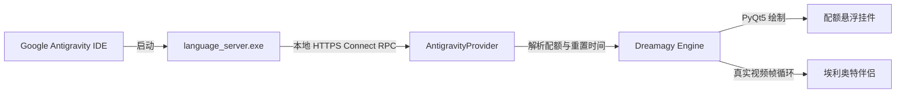

<div align="center">

# DREAMAGY

**适用于 Google Antigravity 的极简悬浮配额监控挂件与桌面伴侣**

`Python 3.10+` • `PyQt5` • `Windows` • `MIT License`

[Русский](README.md) • [English](README.en.md) • [中文](README.zh.md)

<br />


<br />
<br />

**Dreamagy** 是一款轻量级桌面悬浮小部件，可实时精准显示 **Google Antigravity** 模型配额与速率限制（Gemini 3.8 Flash、Gemini 3.1 Pro、Claude Sonnet/Opus、GPT-OSS）。设计灵感源自 [Quotty](https://github.com/confeden/Quotty) 的极简美学与美剧 **Mr. Robot**（《黑客军团》）的科技氛围。

</div>

---

## 视觉效果与动画

<div align="center">
<table>
  <tr>
    <td align="center" width="55%">
      <b>配额进度条 (Quota Bar)</b><br /><br />
      <br />
      <sub>平滑扫描光束 (shimmer)、浮动发光微粒子与自适应状态色彩</sub>
    </td>
    <td align="center" width="45%">
      <b>桌面伴侣：埃利奥特·奥尔德森</b><br /><br />
      <br />
      <sub>真实视频动画序列、呼吸、摇头思考及键盘打字交互</sub>
    </td>
  </tr>
</table>
</div>

### 动态配额进度条 (Quota Bar)
- **平滑扫描光束 (Shimmer)**: 带有柔和渐变的高光波束定期掠过已填充的进度条区域。
- **发光微粒子 (Particles)**: 遵循物理特性的微粒子与气泡在胶囊轨道内部平滑游弋。
- **色彩分级**:
  - `> 40%` - 翡翠绿 (`#34d399`): 配额充裕。
  - `15% - 40%` - 琥珀黄 (`#f59e0b`): 中度消耗警告。
  - `< 15%` - 珊瑚红 (`#ef4444`): 配额临界告急。
- **重置倒计时**: 动态显示配额恢复时间（每周一重置的周配额及 5 小时滚动窗口）。

### 互动桌面伴侣：埃利奥特·奥尔德森 (Mr. Robot)
- **真实视频帧动画**: 还原 Mr. Robot 剧中埃利奥特的真实动作、自然呼吸起伏与转头动作。
- **打字专注模式 (Hacking Focus)**: 通过全局按键监听 (`GetAsyncKeyState`)，在编写代码时埃利奥特会自动前倾身体并聚焦视线，进入黑客专注状态。
- **点击交互**: 鼠标点击触发多样化动作与经典的 fsociety 语录（`"hello, friend."`、`"control is an illusion."`）。
- **停靠与独立双模式 (Docked & Detached)**: 埃利奥特可直接吸附于配额胶囊旁，亦可作为独立悬浮窗口任意拖拽，支持 0.75x、1.0x、1.25x、1.5x 四档缩放。
- **自定义伴侣形象**: 支持通过右键菜单直接导入自定义 PNG、WebP 或 JPG 图像。

---

## 核心特性

- **免配置与无需 API 密钥**: 自动定位本地运行的 Antigravity 语言服务进程，提取 CSRF 令牌，通过本地 HTTPS Connect RPC 协议读取配额。
- **100% 离线与隐私保护**: 所有请求均严格限定于本地地址 `127.0.0.1`。无任何外部服务器通信或遥测上报。
- **暗色毛玻璃悬浮界面 (Dark Glassmorphism)**: 磨砂黑曜石胶囊设计，置顶显示 (`Always on Top`)，支持平滑拖拽并在重启后自动恢复坐标。
- **完整设置面板 (Settings Dialog)**:
  - **外观**: 自定义窗口背景色及各区间配额警示色。
  - **排版**: 自定义字体族（`Segoe UI`、`JetBrains Mono` 等）及字号大小。
  - **动画**: 粒子、扫光光束与角色动作的独立开关控制。
  - **语言**: 俄语 (RU)、英语 (EN)、中文 (ZH) 一键即时切换。
- **灵活的配额行显示**: 支持在 2 行、3 行或自定义模型池（Gemini Weekly、Gemini 5h、Claude & GPT）间切换。
- **Windows 系统托盘集成**: 托盘快捷菜单、最小化显示、透明度调节（50%-100%）及一键屏幕居中复位。

---

## 安装与启动

### 环境要求
- Windows 10 或 Windows 11
- Python 3.10 或更高版本
- 已安装并正在运行的 Google Antigravity

### 快速启动

1. 克隆代码仓库:
   ```bash
   git clone https://github.com/USERNAME/dreamagy.git
   cd dreamagy
   ```

2. 安装依赖项:
   ```bash
   pip install -r requirements.txt
   ```

3. 运行程序:
   ```bash
   python main.py
   ```
   *或直接双击运行 `run.bat` 脚本。*

### Windows 开机自启设置 (可选)
1. 按下 `Win + R` 键，输入 `shell:startup` 并回车。
2. 为 `run.bat` 创建快捷方式，将其放入打开的启动文件夹即可。

---

## 控制与快捷操作

| 操作 | 说明 |
| :--- | :--- |
| **鼠标左键 + 拖拽** | 在桌面上自由移动小部件 |
| **挂件上鼠标右键** | 打开主上下文菜单与设置面板 |
| **点击埃利奥特** | 触发随机动作或显示经典台词 |
| **键盘打字输入** | 自动激活伴侣的深度专注姿态 |
| **系统托盘图标** | 快速刷新配额、进入设置或退出应用 |

---

## 架构与工作原理



1. `antigravity_provider.py` 扫描本地正在运行的 `language_server.exe` 进程 PID。
2. 读取进程启动参数，提取一次性 CSRF 令牌（`--csrf_token`）与本地 HTTPS 端口。
3. 发起本地 Connect Protocol RPC 请求：
   - `/GetUserStatus` - 获取用户账户状态与套餐级别。
   - `/RetrieveUserQuotaSummary` - 获取精确的 `gemini-weekly`、`gemini-5h`、`3p-weekly`、`3p-5h` 分桶用量。
4. 基于 PyQt5 的无边框半透明窗口进行图形渲染。

---

## 项目结构

```
dreamagy/
├── assets/
│   ├── demo.gif              # 主悬浮挂件演示动图
│   ├── quota_bars.gif        # 配额进度条动画演示
│   ├── elliot.gif            # 埃利奥特伴侣动画演示
│   ├── elliot.png            # 埃利奥特静态素材
│   └── pets/                 # 自定义宠物皮肤与动画帧目录
├── antigravity_provider.py   # Antigravity 本地通信模块
├── config.py                 # 配置加载与保存模块
├── config.json               # 用户配置参数
├── i18n.py                   # 国际化多语言支持模块 (RU, EN, ZH)
├── main.py                   # 程序主入口与全局键盘监听
├── pet_elliot.py             # 桌面伴侣动作引擎
├── settings_dialog.py        # 设置面板
├── tray.py                   # Windows 系统托盘管理
├── widget.py                 # 核心胶囊挂件
├── requirements.txt          # Python 依赖清单
├── run.bat                   # Windows 快速启动脚本
├── README.md                 # 俄语项目文档
├── README.en.md              # 英语项目文档
└── README.zh.md              # 中文项目文档
```

---

## 许可证

本项目遵循 MIT License 开源许可协议。详情请参阅 `LICENSE` 文件。

<div align="center">
<sub>致敬 Quotty 项目与电视剧《黑客军团》(Mr. Robot)。专为 Google Antigravity 开发者打造。</sub>
</div>
